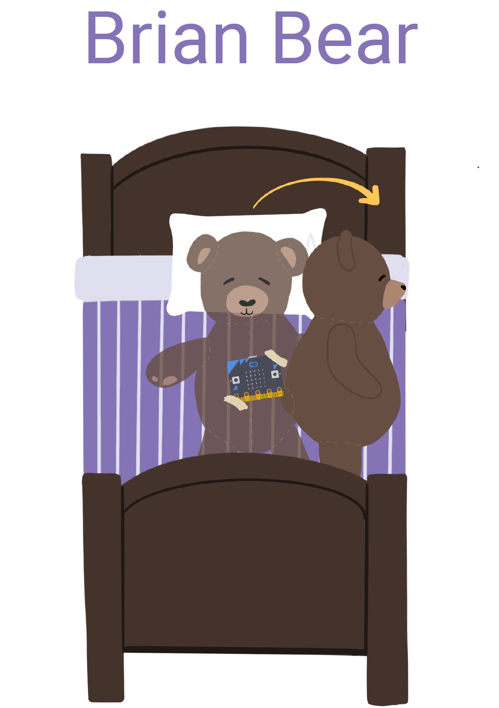
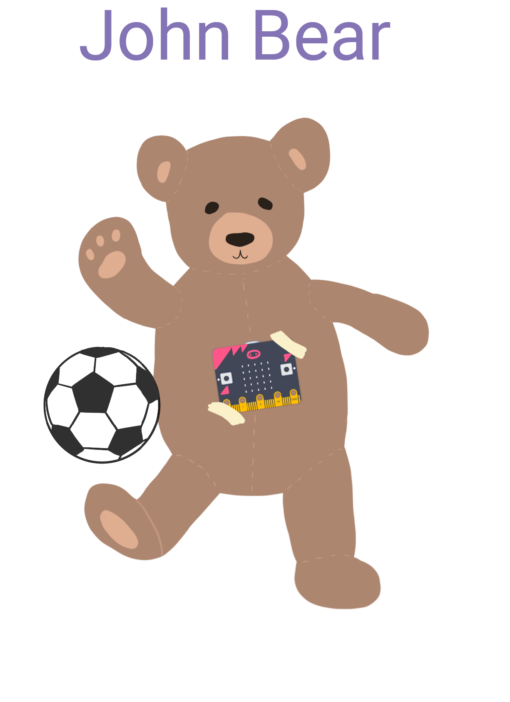

# Case Studies

Each child's project was unique and developed out of their own interests and experiences. Two stories stood out based on their experieces using the machine learning tool. The first, Brian Bear, creates distinctly different sample recordings for each gesture (for instance, performs the gesture _sleep_ in three different ways). In the second case study, John Bear troubleshoots and diagnoses why two of their gestures are conflicting with one another. 

<html>
  

  

    

       
    

    

       
    

  
 
</html>
